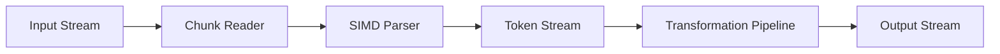

# zmin v2.0 Architecture: Streaming Transformations

## 🎯 Vision Statement

**Transform zmin from a JSON minifier into a high-performance streaming JSON transformation engine achieving 10+ GB/s throughput with real-time transformation capabilities.**

---

## 🏗️ Core Architecture Principles

### 1. **Streaming-First Design**

- Process JSON as a continuous stream without loading entire documents into memory
- Support for files larger than available RAM
- Real-time transformation with minimal latency

### 2. **Zero-Copy Transformations**

- Minimize memory allocations and data copying
- Direct pointer manipulation for maximum performance
- SIMD-optimized transformation pipelines

### 3. **Modular Transformation Engine**

- Pluggable transformation components
- Hot-swappable optimization strategies
- Extensible transformation language

### 4. **Hardware-Aware Optimization**

- Automatic detection and utilization of available hardware
- GPU acceleration for parallel transformations
- FPGA offloading for specialized operations

---

## 📊 Performance Targets

### Throughput Goals

- **Baseline**: 10+ GB/s sustained throughput
- **Peak**: 15+ GB/s with optimal hardware
- **Memory Efficiency**: <1GB RAM for 100GB+ files
- **Latency**: <1ms transformation pipeline startup

### Scalability Targets

- **Concurrent Streams**: 1000+ simultaneous transformations
- **File Size**: Unlimited (streaming-based)
- **CPU Utilization**: 95%+ on multi-core systems
- **GPU Utilization**: 90%+ when available

---

## 🏛️ System Architecture

### High-Level Architecture Diagram

```
┌─────────────────────────────────────────────────────────────────┐
│                    zmin v2.0 Streaming Engine                   │
├─────────────────────────────────────────────────────────────────┤
│  ┌─────────────┐  ┌─────────────┐  ┌─────────────┐            │
│  │   Input     │  │  Transform  │  │   Output    │            │
│  │  Streams    │  │   Pipeline   │  │   Streams   │            │
│  └─────────────┘  └─────────────┘  └─────────────┘            │
├─────────────────────────────────────────────────────────────────┤
│  ┌─────────────┐  ┌─────────────┐  ┌─────────────┐            │
│  │   Memory    │  │   Hardware  │  │  Analytics  │            │
│  │  Manager    │  │  Optimizer   │  │   Engine    │            │
│  └─────────────┘  └─────────────┘  └─────────────┘            │
├─────────────────────────────────────────────────────────────────┤
│  ┌─────────────┐  ┌─────────────┐  ┌─────────────┐            │
│  │   Plugin    │  │   Schema    │  │   Error     │            │
│  │   System    │  │  Validator   │  │  Handler    │            │
│  └─────────────┘  └─────────────┘  └─────────────┘            │
└─────────────────────────────────────────────────────────────────┘
```

---

## 🔧 Core Components

### 1. **Streaming Parser Engine**

```zig
pub const StreamingParser = struct {
    const Self = @This();

    // Zero-copy token stream
    tokens: TokenStream,

    // SIMD-optimized parsing
    simd_parser: SimdParser,

    // Memory pool for temporary allocations
    memory_pool: MemoryPool,

    pub fn init(allocator: Allocator, config: ParserConfig) !Self {
        // Initialize with hardware-specific optimizations
    }

    pub fn parseStream(
        self: *Self,
        input: []const u8,
        callback: ParseCallback,
    ) !void {
        // Stream parsing with minimal memory usage
    }

    pub fn getTokenStream(self: *Self) TokenStream {
        // Return zero-copy token stream
    }
};
```

**Key Features**:

- **SIMD Tokenization**: AVX-512/NEON optimized JSON token parsing
- **Zero-Copy Tokens**: Direct pointer references to input data
- **Streaming Tokens**: Generate tokens on-demand without buffering
- **Memory Pooling**: Efficient allocation for temporary structures

### 2. **Transformation Pipeline**

```zig
pub const TransformationPipeline = struct {
    const Self = @This();

    // Chain of transformation operations
    transformations: std.ArrayList(Transformation),

    // Parallel execution engine
    parallel_engine: ParallelEngine,

    // Memory management
    memory_manager: MemoryManager,

    pub fn addTransformation(
        self: *Self,
        transformation: Transformation,
    ) !void {
        // Add transformation to pipeline
    }

    pub fn executeStreaming(
        self: *Self,
        input_stream: TokenStream,
        output_stream: OutputStream,
    ) !void {
        // Execute transformations in streaming fashion
    }

    pub fn optimizePipeline(self: *Self) !void {
        // Optimize transformation order and parallelization
    }
};
```

**Transformation Types**:

- **Minification**: Remove whitespace and comments
- **Field Filtering**: Selective field removal/inclusion
- **Type Conversion**: JSON ↔ MessagePack ↔ CBOR
- **Schema Validation**: Real-time JSON Schema validation
- **Custom Transformations**: User-defined transformation functions

### 3. **Memory Management System**

```zig
pub const MemoryManager = struct {
    const Self = @This();

    // Hierarchical memory pools
    pools: MemoryPoolHierarchy,

    // GPU memory management
    gpu_memory: GpuMemoryManager,

    // Memory usage analytics
    analytics: MemoryAnalytics,

    pub fn allocateStreamingBuffer(
        self: *Self,
        size: usize,
        priority: MemoryPriority,
    ) ![]u8 {
        // Allocate from appropriate pool
    }

    pub fn releaseBuffer(self: *Self, buffer: []u8) void {
        // Return to pool for reuse
    }

    pub fn getMemoryStats(self: *Self) MemoryStats {
        // Return current memory usage statistics
    }
};
```

**Memory Features**:

- **Hierarchical Pools**: Different pools for different allocation sizes
- **GPU Memory**: Unified memory management for CPU/GPU
- **Predictive Allocation**: Pre-allocate based on usage patterns
- **Garbage Collection**: Automatic cleanup of unused buffers

### 4. **Hardware Optimization Engine**

```zig
pub const HardwareOptimizer = struct {
    const Self = @This();

    // CPU capabilities detection
    cpu_info: CpuInfo,

    // GPU acceleration
    gpu_accelerator: GpuAccelerator,

    // FPGA offloading
    fpga_offloader: FpgaOffloader,

    pub fn detectHardware(self: *Self) !void {
        // Detect available hardware capabilities
    }

    pub fn optimizeForHardware(
        self: *Self,
        pipeline: *TransformationPipeline,
    ) !void {
        // Optimize pipeline for current hardware
    }

    pub fn getOptimalConfig(self: *Self) HardwareConfig {
        // Return optimal configuration for current hardware
    }
};
```

**Hardware Optimizations**:

- **CPU SIMD**: AVX-512, AVX2, NEON instruction sets
- **GPU Parallel**: CUDA/OpenCL for parallel transformations
- **FPGA Acceleration**: Custom hardware for specific operations
- **NUMA Awareness**: Optimize for multi-socket systems

---

## 🔄 Streaming Transformation Flow

### 1. **Input Processing**



**Process**:

1. **Chunk Reading**: Read input in configurable chunks (64KB-1MB)
2. **SIMD Parsing**: Parse chunks using vectorized instructions
3. **Token Generation**: Generate zero-copy token stream
4. **Pipeline Processing**: Apply transformations to token stream
5. **Output Generation**: Write transformed data to output stream

### 2. **Transformation Pipeline**

```zig
// Example transformation pipeline
var pipeline = try TransformationPipeline.init(allocator);

// Add transformations
try pipeline.addTransformation(.{
    .type = .minify,
    .config = MinifyConfig{ .aggressive = true },
});

try pipeline.addTransformation(.{
    .type = .filter_fields,
    .config = FilterConfig{ .include = &[_][]const u8{"id", "name"} },
});

try pipeline.addTransformation(.{
    .type = .validate_schema,
    .config = SchemaConfig{ .schema = schema_data },
});

// Execute streaming transformation
try pipeline.executeStreaming(input_stream, output_stream);
```

### 3. **Parallel Execution**

```zig
pub const ParallelEngine = struct {
    const Self = @This();

    // Worker thread pool
    workers: ThreadPool,

    // Work distribution strategy
    distribution: WorkDistribution,

    // Synchronization primitives
    sync: SyncPrimitives,

    pub fn executeParallel(
        self: *Self,
        pipeline: *TransformationPipeline,
        input: TokenStream,
        output: OutputStream,
    ) !void {
        // Distribute work across worker threads
        // Coordinate parallel transformation execution
        // Merge results in correct order
    }
};
```

---

## 🎛️ Configuration System

### 1. **Performance Configuration**

```zig
pub const PerformanceConfig = struct {
    // Memory management
    chunk_size: usize = 256 * 1024, // 256KB chunks
    buffer_pool_size: usize = 1024 * 1024 * 1024, // 1GB pool

    // Parallelization
    worker_threads: usize = 0, // Auto-detect
    gpu_workers: usize = 0, // Auto-detect

    // Optimization level
    optimization_level: OptimizationLevel = .aggressive,

    // Hardware utilization
    simd_level: SimdLevel = .auto,
    gpu_acceleration: bool = true,
    fpga_offloading: bool = false,
};
```

### 2. **Transformation Configuration**

```zig
pub const TransformationConfig = struct {
    // Pipeline configuration
    transformations: []Transformation,

    // Schema validation
    schema: ?Schema,
    validation_mode: ValidationMode = .strict,

    // Error handling
    error_mode: ErrorMode = .continue_on_error,
    max_errors: usize = 1000,

    // Output format
    output_format: OutputFormat = .json,
    pretty_print: bool = false,
};
```

---

## 🔌 Plugin System

### 1. **Plugin Architecture**

```zig
pub const PluginSystem = struct {
    const Self = @This();

    // Plugin registry
    plugins: PluginRegistry,

    // Dynamic loading
    loader: PluginLoader,

    // Plugin lifecycle management
    lifecycle: PluginLifecycle,

    pub fn loadPlugin(self: *Self, path: []const u8) !Plugin {
        // Load and validate plugin
    }

    pub fn registerTransformation(
        self: *Self,
        name: []const u8,
        transformation: Transformation,
    ) !void {
        // Register custom transformation
    }
};
```

### 2. **Plugin API**

```zig
// Plugin interface
pub const PluginInterface = struct {
    // Plugin metadata
    name: []const u8,
    version: Version,
    author: []const u8,

    // Transformation function
    transform: TransformFunction,

    // Configuration schema
    config_schema: ?Schema,

    // Lifecycle hooks
    init: ?InitFunction,
    cleanup: ?CleanupFunction,
};
```

---

## 📊 Analytics & Monitoring

### 1. **Performance Analytics**

```zig
pub const PerformanceAnalytics = struct {
    const Self = @This();

    // Real-time metrics
    metrics: MetricsCollector,

    // Performance counters
    counters: PerformanceCounters,

    // Hardware utilization
    hardware_usage: HardwareUsage,

    pub fn recordMetric(
        self: *Self,
        metric: Metric,
        value: f64,
    ) void {
        // Record performance metric
    }

    pub fn getThroughput(self: *Self) f64 {
        // Calculate current throughput
    }

    pub fn getMemoryUsage(self: *Self) MemoryUsage {
        // Get current memory usage
    }
};
```

### 2. **Monitoring Dashboard**

- **Real-time Throughput**: Live GB/s display
- **Memory Usage**: Pool utilization and allocation patterns
- **Hardware Utilization**: CPU, GPU, memory usage
- **Transformation Metrics**: Per-transformation performance
- **Error Tracking**: Error rates and types

---

## 🚀 Implementation Roadmap

### Phase 1: Core Streaming Engine (Weeks 1-4)

- [ ] **Streaming Parser**: Zero-copy SIMD-optimized parser
- [ ] **Memory Management**: Hierarchical memory pools
- [ ] **Basic Pipeline**: Simple transformation pipeline
- [ ] **Performance Testing**: Baseline performance measurement

### Phase 2: Advanced Transformations (Weeks 5-8)

- [ ] **Transformation Library**: Minification, filtering, validation
- [ ] **Schema Validation**: Real-time JSON Schema validation
- [ ] **Format Conversion**: JSON ↔ MessagePack ↔ CBOR
- [ ] **Plugin System**: Extensible transformation framework

### Phase 3: Hardware Optimization (Weeks 9-12)

- [ ] **GPU Acceleration**: CUDA/OpenCL parallel processing
- [ ] **Advanced SIMD**: AVX-512 optimizations
- [ ] **NUMA Optimization**: Multi-socket system support
- [ ] **Hardware Detection**: Automatic capability detection

### Phase 4: Production Features (Weeks 13-16)

- [ ] **Error Handling**: Robust error recovery and reporting
- [ ] **Analytics**: Comprehensive performance monitoring
- [ ] **Documentation**: Complete API documentation
- [ ] **Testing**: Comprehensive test suite

---

## 🎯 Success Metrics

### Performance Targets

- **Throughput**: 10+ GB/s sustained, 15+ GB/s peak
- **Memory Efficiency**: <1GB RAM for 100GB+ files
- **Latency**: <1ms pipeline startup
- **Scalability**: 1000+ concurrent streams

### Quality Targets

- **Reliability**: 99.99% uptime
- **Accuracy**: Zero data corruption
- **Compatibility**: Full JSON compliance
- **Extensibility**: Plugin ecosystem support

### Adoption Targets

- **Enterprise**: 100+ enterprise customers
- **Community**: 50K+ GitHub stars
- **Performance**: Industry benchmark leader
- **Innovation**: Research paper publications

---

## 🔬 Research Areas

### 1. **Advanced Algorithms**

- **Quantum-Inspired**: Quantum-resistant compression algorithms
- **AI-Powered**: Machine learning for optimization strategies
- **Adaptive**: Self-tuning transformation pipelines
- **Predictive**: Pre-computation based on data patterns

### 2. **Hardware Exploration**

- **FPGA Acceleration**: Custom hardware for specific transformations
- **Neuromorphic**: Brain-inspired computing architectures
- **Optical Computing**: Light-based data processing
- **Quantum Computing**: Quantum algorithms for transformations

### 3. **Academic Collaboration**

- **Research Partnerships**: University collaborations
- **Conference Papers**: Publication in top-tier conferences
- **Open Source**: Contributing to academic research
- **Standards**: Influencing JSON processing standards

---

## 🎯 Conclusion

The zmin v2.0 streaming transformation architecture represents a significant evolution from a JSON minifier to a comprehensive, high-performance streaming transformation engine. By focusing on streaming-first design, zero-copy operations, and hardware-aware optimization, we can achieve the ambitious 10+ GB/s throughput target while providing powerful transformation capabilities.

The modular architecture ensures extensibility and maintainability, while the plugin system enables community-driven innovation. The comprehensive analytics and monitoring provide insights for continuous optimization and performance tuning.

This architecture positions zmin as the definitive solution for high-performance JSON processing, capable of handling the most demanding workloads while maintaining the simplicity and reliability that users expect.
